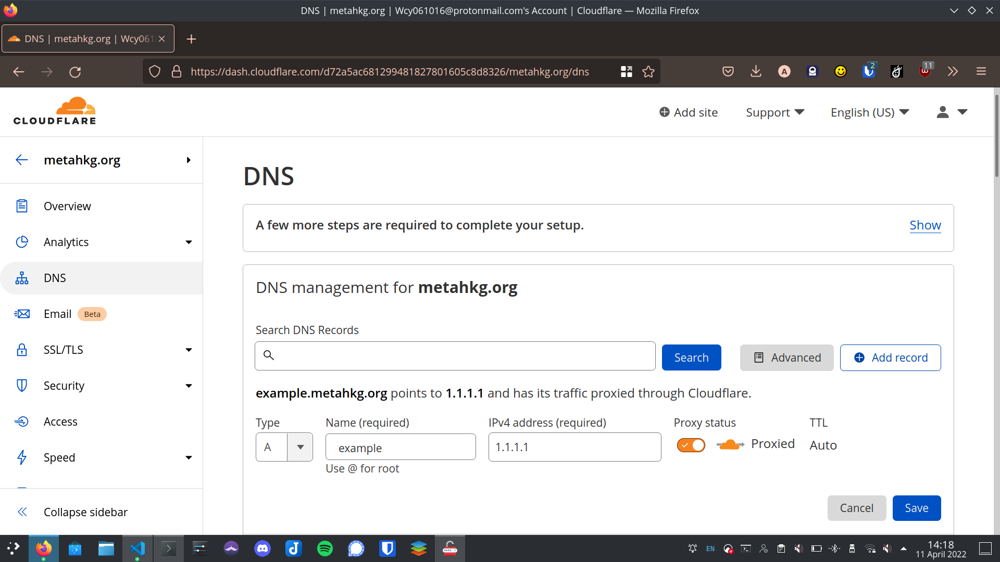

# DNS configuration

Point your domain to your server's ip address.

## Local

- edit /etc/hosts, add a line at the end of the file

```bash title=/etc/hosts
# ...

127.0.0.1 example.com
```

## Server

Add an `A record` to your domain pointing to your server's IP address.

- [cloudflare](https://dash.cloudflare.com):


